<div align="center">

# ⚔️ GUADRAILS-RAG-WITH-ENDEE

### Privacy-First, Fully Offline AI Document Assistant  
**Enhanced with Endee Vector Database & Tiered Security Guardrails**  
*v2.1.0 — Production-Ready Enterprise Architecture*

<br/>


<br/>



<br/>

> **Modern RAG pipeline powered by Endee for ultra-fast semantic search.**  
> Complete local privacy. No data ever leaves your device.

</div>

---

## 🎯 What's New in v2.1

- 🦅 **Endee Vector Core**: Native integration with Endee for billion-scale vector retrieval.
- 🎨 **ChatGPT-Refined UI**: Restored the classic green aesthetic with modern sidebar navigation.
- 📂 **Multi-Tab Sidebar**: Dedicated Chat, Documents, and Settings views for clarity.
- 🏠 **Smart Home Dashboard**: Drag-and-drop landing page for instant document processing.
- ⚡ **Asynchronous Indexing**: Real-time status updates during document ingestion.

---

## 🚀 Quick Setup

### 1. Requirements
- **Ollama**: [ollama.com](https://ollama.com)
- **Endee**: [github.com/endee-io/endee](https://github.com/endee-io/endee)

### 2. Run Application
```bash
# Install dependencies
pip install -r requirements.txt

# Start the server
python app.py
```
Open [http://localhost:8000](http://localhost:8000) to start chatting.

---

## 🛠️ Tech Stack
- **Backend**: FastAPI (Python)
- **Vector DB**: Endee
- **Retriever**: LangChain + Endee Native Bridge
- **LLMs**: Ollama (Llama3, Gemma2, Mistral)
- **Frontend**: Vanilla JS + CSS (Modern Glassmorphism)

---
<div align="center">
[Repository](https://github.com/sowmiyan-s/GUADRAILS-RAG-WITH-ENDEE) • [Issues](https://github.com/sowmiyan-s/GUADRAILS-RAG-WITH-ENDEE/issues) • [Docs](./docs)

<br/>

**Architected & Developed by [Sowmiyan S](https://github.com/sowmiyan-s)**
</div>
